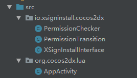
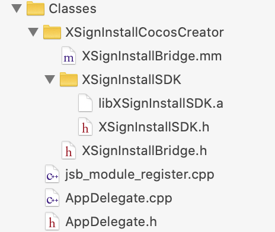

# XSigninstall-CocosCreator
CocosCreator 集成 XSigninstall SDK  

## Android 集成
集成 XSigninstall SDK 到 CocosCreator Android 项目中，请参考 [Android 集成指南](https://www.zsign.net/web/build/index.html#/ditribution/androidPakage/combineSdk)

## 桥接文件集成
#### 下载桥接文件
	下载后将XSignInstallCocosCreator整个目录放到Classes目录下（或其他文件目录），再将src内文件放入android工程src目录下

#### 导入头文件
在`AppActivity.java`中导入头文件
``` cpp
import io.xsigninstall.cocos2dx.XSignInstallInterface;
```
#### 初始化
在 `AppActivity.java` 的 `onCreate` 的方法中进行初始化。
``` cpp
@Override
protected void onCreate(Bundle savedInstanceState) {
	super.onCreate(savedInstanceState);
	XSignInstallInterface.init(this);
}
```
#### 代理设置
``` cpp
@Override
protected void onResume(){
	super.onResume();
	XSignInstallInterface.initStatistics(this);
}
@Override
protected void onStart() {
	super.onStart();
	XSignInstallInterface.checkWakeup();
}
```

## iOS 集成
集成 XSigninstall SDK 到 CocosCreator iOS 项目中，请参考 [iOS 集成指南](https://www.zsign.net/web/build/index.html#/ditribution/iosPakage/combineSdk)


## 桥接文件集成
#### 下载并导入桥接文件
	下载后将XSignInstallCocosCreator整个目录放到Classes目录下（或其他文件目录），并导入整个目录到项目中（除了android子目录外）

#### 导入头文件
在 `AppController.mm`中导入头文件
``` cpp
#import "XSignInstallBridge.h"
```
注：请根据文件目录结构适当调整引用路径
#### 初始化
在 `AppController.mm` 的 `didFinishLaunchingWithOptions` 的方法中进行初始化。
``` cpp
- (BOOL)application:(UIApplication *)application didFinishLaunchingWithOptions:(NSDictionary *)launchOptions {

	[XSignInstallSDK initWithDelegate:self];

    return YES;
}
```
#### 代理设置
``` cpp
- (BOOL)application:(UIApplication *)application continueUserActivity:(NSUserActivity *)userActivity restorationHandler:(void (^)(NSArray * _Nullable))restorationHandler{
  //处理通过XSigninstall一键唤起App时传递的数据
  [XSignInstallSDK continueUserActivity:userActivity];
  //其他第三方回调；
   return YES;
}

//适用目前所有iOS版本
-(BOOL)application:(UIApplication *)application openURL:(NSURL *)url sourceApplication:(NSString *)sourceApplication annotation:(id)annotation{
    //处理通过XSignInstall URL Scheme唤起App的数据
    [XSignInstallSDK handLinkURL:url];
    //其他第三方回调；
    return YES;
}

//通过XSignInstall获取已经安装App被唤醒时的参数（如果是通过渠道页面唤醒App时，会返回渠道编号）
-(void)getWakeUpParams:(NSDictionary *)appData{
    [XSignInstallBridge checkWakeUpJson:appData];
}
```

## 使用指南  

### 除了`快速下载`功能，其他功能都需要先引入 XSigninstall 脚本
将 `Script` 文件夹中的 `XSignInstall.ts`文件 拖入项目的脚本文件夹 `Script` 中，在组件中使用时，请先引入脚本
``` ts
import XSignInstall from "./XSignInstall";
```

### 1 快速下载
如果只需要快速下载功能，无需其它功能（携带参数安装、渠道统计、一键拉起），完成初始化即可（包括iOS.md和Android.md中的初始化工作）


### 2 一键拉起  
##### 一键拉起的配置见iOS.md和Android.md相关文档

#### 获取拉起数据
在组件脚本的 `onLoad` 方法中，注册拉起回调，这样当 App 被拉起时，会回调方法，并可在回调中获取拉起数据

``` ts
    // 在 onLoad 中调用注册拉起回调方法
    XSignInstall.registerWakeupCallback((data) => {
        cc.log("拉起参数：data=" + JSON.stringify(data));
    });
```

### 3 携带参数安装（高级版功能）
#### 获取安装数据
在应用需要安装参数时，调用以下 api 获取由 SDK 保存的安装参数，可设置超时时长(一般为8～15秒)，单位秒，
``` ts
    //在 App 业务需要时调用
    XSignInstall.getInstall((data) => {
        cc.log("安装参数：data=" + JSON.stringify(data));
    });
```
_备注：  
- 注意这个安装参数尽量不要自己保存，在每次需要用到的时候调用该方法去获取，因为如果获取成功sdk会保存在本地  
- 该方法可重复获取参数，如需只要在首次安装时获取，可设置标记，详细说明可参考openinstall官网的常见问题

### 4 渠道统计（高级版功能）
SDK 会自动完成访问量、点击量、安装量、活跃量、留存率等统计工作。其它业务相关统计由开发人员代码埋点上报

##### 4.1 注册上报
在用户注册成功后，调用接口上报注册量
``` ts
    XSignInstall.reportRegister();
```

## 导出apk/api包并上传
- 代码集成完毕后，需要导出安装包上传XSignInstall后台，XSignInstall会自动完成所有的应用配置工作。  
- 上传完成后即可开始在线模拟测试，体验完整的App安装/拉起流程；待测试无误后，再完善下载配置信息。  
